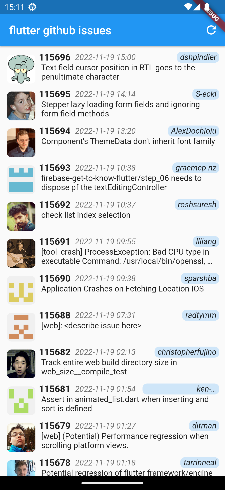
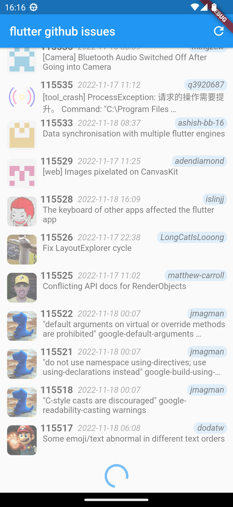
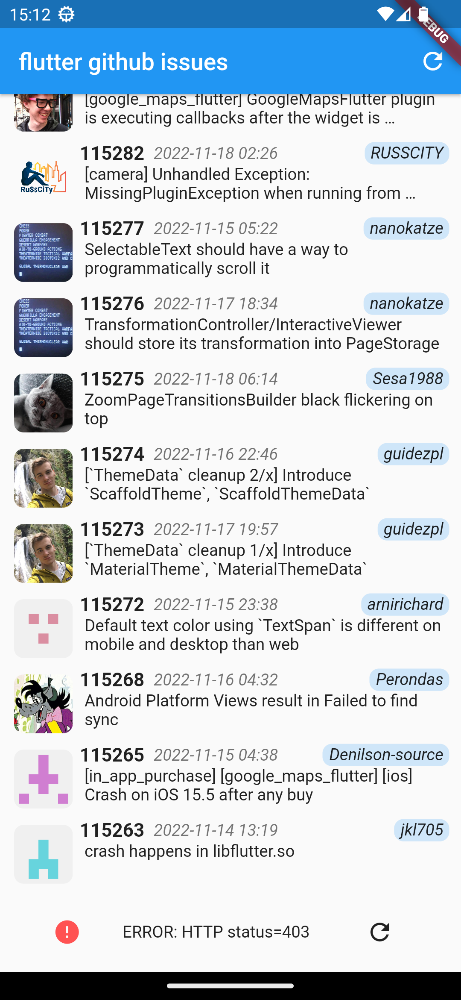

# pagination_list

スマホアプリでよく使うリスト表示をriverpodを使って実装したサンプルコードです。  
flutterのgithubのissueを20件ずつ読み込み、端までスクロールしたら次を読み込むページネーション動作を実装しています。  
MVVM + Repositoryパターンで作成してあります。  

[untitled.webm](https://user-images.githubusercontent.com/105623497/202860564-a1680226-d8fa-4553-8c1e-a4563ec32b1f.webm)

## screen shot

|リスト表示|読み込み中動作|エラー動作|
|---|---|---|
||||

## Keyword

- Flutter
- Riverpod
- StateNotifierProvider
- Pagination List
- MVVM + Repository
